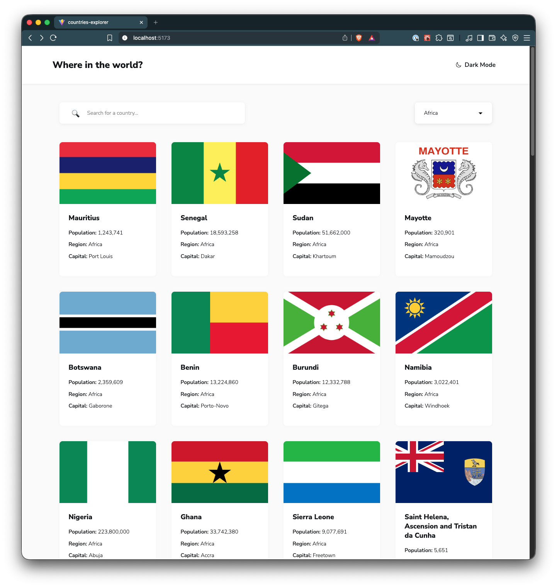
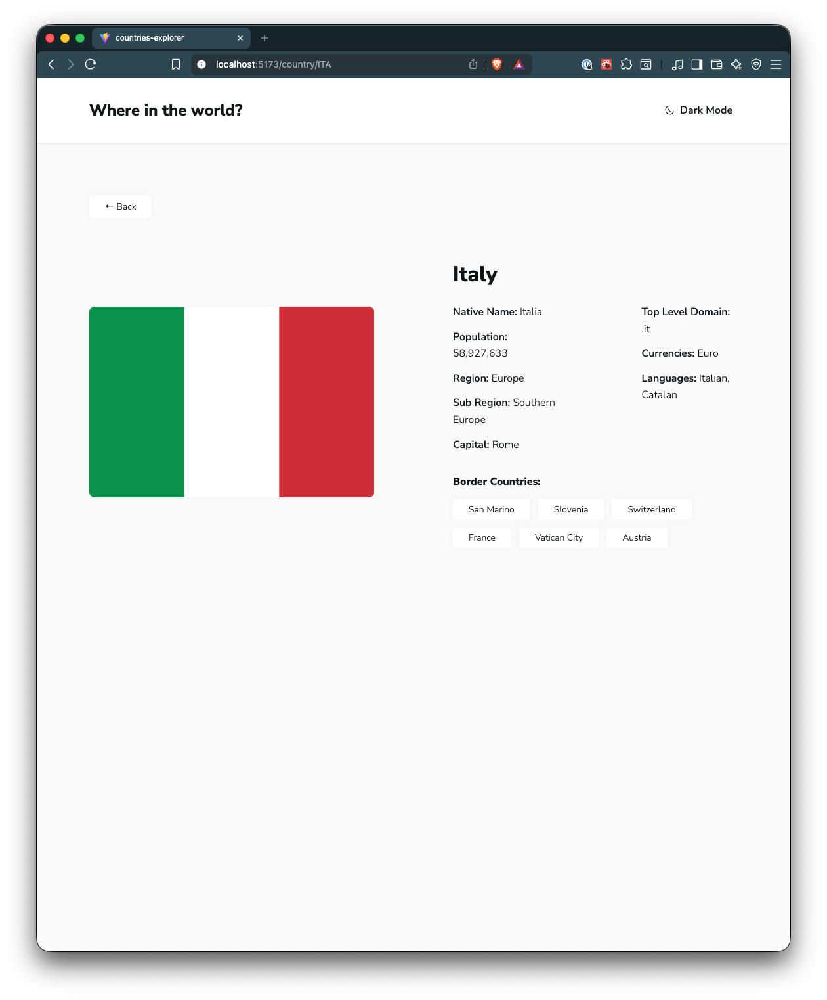
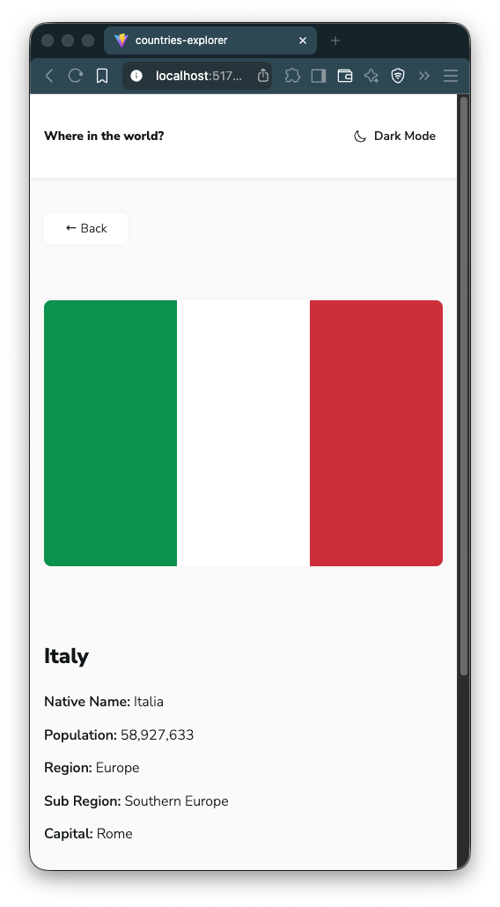

# 🌍 Countries Explorer – REST Countries App

A clean and responsive country information web application inspired by the **Frontend Mentor challenge**.
This version integrates with the **REST Countries API**, allows **searching and filtering by region**, supports **light/dark mode**, and includes a fully styled **country card UI** with detailed country pages.

---

### 🎯 Objectives / The Challenge

The goal of this project is to build a fully functional country explorer that interacts with the **REST Countries API**. The design and layout aim to closely match the original challenge specifications while ensuring a smooth and responsive user experience across all devices.

This project serves as practice for working with APIs, managing client-side state, handling errors, building responsive layouts, and implementing theming with React Context.

#### 🧩 Users should be able to:

* **View a responsive layout** that adapts to different screen sizes (mobile, tablet, desktop)
* **Search countries by name**
* **Filter countries by region**
* **Click a country card** to view detailed information, including:

  * Flag, name, native name
  * Population, region, subregion
  * Capital, top-level domain
  * Currencies, languages
  * Border countries (clickable buttons to navigate)
* **Toggle between light and dark theme**
* **Receive clear error messages** if API fetch fails

---

### 🖥️ Desktop View




### 📱 Mobile View



---

### 🚀 Live Demo


> 🌐 **Live Demo:** [Click Here for Live Demo](https://delicate-cajeta-044ccc.netlify.app/)

> 💻 **Repository:** [View Source on GitHub](https://github.com/structbase/REST-Countries-API-with-Color-Theme-Switcher)

---

## 📌 Features

### **✔ Country Listing & Cards**

Displays all countries in a clean, card-based UI with flag, population, region, and capital.

### **✔ Search & Filter**

* Search by country name
* Filter by region (Africa, Americas, Asia, Europe, Oceania)

### **✔ Country Details Page**

Clicking a country shows detailed info including border countries with buttons to navigate.

### **✔ Light/Dark Mode**

Switch themes with the toggle button in the navbar. Theme persists in **Local Storage**.

### **✔ Responsive UI**

Cards, search bar, filters, and country details adapt to mobile, tablet, and desktop screens.

### **✔ API Integration**

Fetches data from the **REST Countries API** with error handling for failed requests.

---

## 🛠️ Built With

* **React (TypeScript)**
* **React Router**
* **Custom Hooks** (`useFetch`, `useTheme`)
* **CSS3 / Flexbox / Grid**
* **REST Countries API**
* **Local Storage** (for theme persistence)

---

## 📂 Folder Structure

```
REST-Countries-API-with-Color-Theme-Switcher/
├── README.md
├── eslint.config.js
├── index.html
├── package-lock.json
├── package.json
├── public
│   ├── screenshots
│   │   ├── desktop.png
│   │   ├── desktop2.png
│   │   └── mobile.png
│   └── vite.svg
├── src
│   ├── App.css
│   ├── App.tsx
│   ├── assets
│   │   ├── docs
│   │   │   ├── README-template.md
│   │   │   ├── README.md
│   │   │   ├── data.json
│   │   │   ├── design
│   │   │   │   ├── desktop-design-detail-dark.jpg
│   │   │   │   ├── desktop-design-detail-light.jpg
│   │   │   │   ├── desktop-design-home-dark.jpg
│   │   │   │   ├── desktop-design-home-light.jpg
│   │   │   │   ├── desktop-preview.jpg
│   │   │   │   ├── mobile-design-detail-dark.jpg
│   │   │   │   ├── mobile-design-detail-light.jpg
│   │   │   │   ├── mobile-design-home-dark.jpg
│   │   │   │   └── mobile-design-home-light.jpg
│   │   │   └── style-guide.md
│   │   └── react.svg
│   ├── components
│   │   ├── CountryCard
│   │   │   ├── CountryCard.css
│   │   │   └── CountryCard.tsx
│   │   ├── Navbar
│   │   │   ├── Navbar.css
│   │   │   └── Navbar.tsx
│   │   ├── RegionFilter
│   │   │   ├── RegionFilter.css
│   │   │   └── RegionFilter.tsx
│   │   ├── SearchBar
│   │   │   ├── SearchBar.css
│   │   │   └── SearchBar.tsx
│   │   └── ThemeIcon
│   │       └── ThemeIcon.tsx
│   ├── context
│   │   └── theme
│   │       ├── ThemeContext.tsx
│   │       └── ThemeProvider.tsx
│   ├── hooks
│   │   ├── useFetch.ts
│   │   └── useTheme.ts
│   ├── index.css
│   ├── main.tsx
│   ├── pages
│   │   ├── CountryPage
│   │   │   ├── CountryPage.css
│   │   │   └── CountryPage.tsx
│   │   └── HomePage
│   │       ├── HomePage.css
│   │       └── HomePage.tsx
│   └── types
│       ├── country-api.ts
│       ├── country-card-props.ts
│       ├── country-detail.ts
│       ├── region-filter-props.ts
│       └── search-bar-props.ts
├── tsconfig.app.json
├── tsconfig.json
├── tsconfig.node.json
└── vite.config.ts

20 directories, 53 files
```

---

## 🚀 Getting Started

### **1️⃣ Clone the repository**

```bash
git clone https://github.com/yourusername/countries-explorer.git
cd countries-explorer
```

### **2️⃣ Install dependencies**

```bash
npm install
```

### **3️⃣ Run the project locally**

```bash
npm start
```

Open [http://localhost:5173](http://localhost:5173) to view it in the browser.

---

## 🧠 How It Works

### **➡ Fetching country data**

```ts
const { data, loading, error } = useFetch<CountryApi[]>(
    "https://restcountries.com/v3.1/all?fields=name,flags,region,population,capital,cca3"
);
```

### **➡ Filtering by region**

```ts
const filteredCountries = region
    ? countries.filter((c) => c.region === region)
    : countries;
```

### **➡ Search by name**

```ts
const searchedCountries = countries.filter((c) =>
    c.name.toLowerCase().includes(search.toLowerCase())
);
```

### **➡ Light/Dark Theme**

```ts
const { theme, toggleTheme } = useTheme();
document.documentElement.style.setProperty('--bg', theme === 'light' ? '...' : '...');
```

### **➡ Border Countries**

```ts
const { data: borderCountries } = useFetch<CountryApi[]>(
    `https://restcountries.com/v3.1/alpha?codes=${borderCodes}`
);
```

---

## 📣 Acknowledgements, Credits & Resources

### 🍽️ Challenge By 
-   [**Frontend Mentor** – Challenge Provider](https://www.frontendmentor.io/challenges/rest-countries-api-with-color-theme-switcher-5cacc469fec04111f7b848ca)

### 🍽️ API Provider

-   [**REST Countries API** – API Provider](https://restcountries.com/)

### 
-   [**Netlify** – API Provider](https://restcountries.com/)

---

### 📘 Documentation
-   [**MDN Web Docs** – Fetch API, Local Storage, AbortController ](https://developer.mozilla.org/)
-   [**React Documentation** ](https://react.dev/)
-   [**React Router Documentation** ](https://reactrouter.com/)
-   [**TypeScript Handbook** ](https://www.typescriptlang.org/docs/)

---

# 📝 Reflection Document

Building this project helped solidify my skills in **React**, **TypeScript**, and **API integration**. Implementing a theme provider reinforced the use of **React Context**, while building the search and region filter taught me how to efficiently filter and manage client-side state. Handling border countries required fetching related resources dynamically, which improved my understanding of API queries and dependent requests.

I also focused on **responsive design**, using CSS Grid and Flexbox, ensuring the layout works across multiple devices. The project emphasized **clean code**, **reusable components**, and **state management** best practices.

---

## ✍️ Author

Developed by **Abenezer**

> Junior Developer


